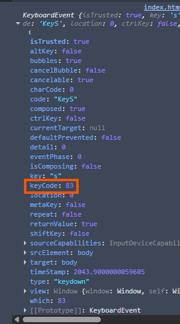

keyCode berasal dari object yang dilihat dari console:
```js
 window.addEventListener('keydown', function(e){
    console.log(e);
  });
```


Alternatifnya bisa dengan https://www.toptal.com/developers/keycode


data-* -> https://css-tricks.com/a-complete-guide-to-data-attributes/

data-key digunakan sebagai hookup untuk "key" dengan suara tertentu dan animasi ter trigger juga